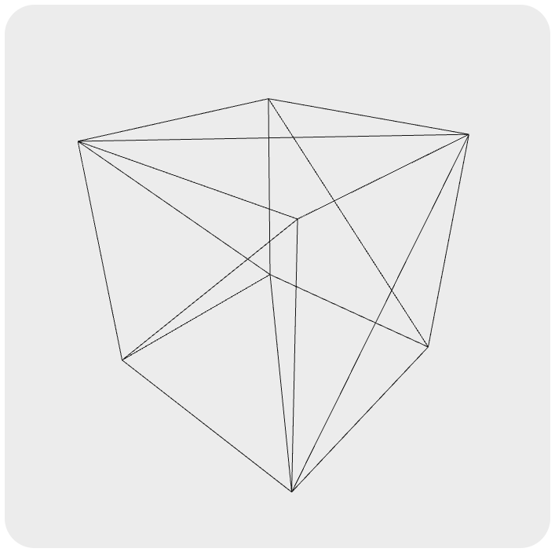

# threejs-first-project

My first project in ThreeJS to learn how it works. 😎

### OrbitControl

It's a class in ThreeJS that enable movement a object 3D in environment through cursor handle.

## Cube render Image

